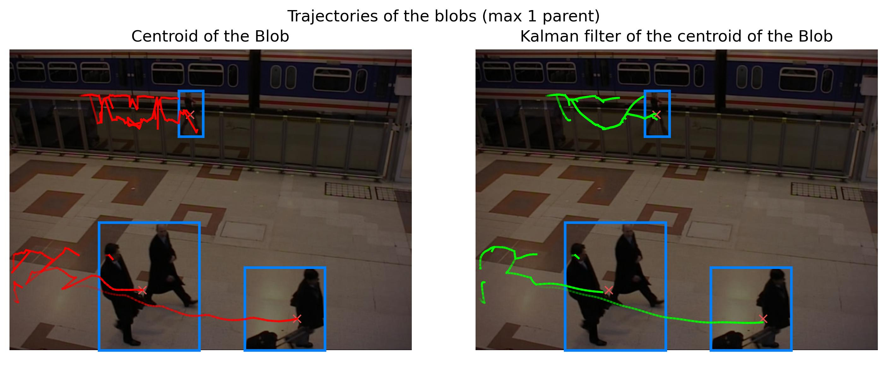
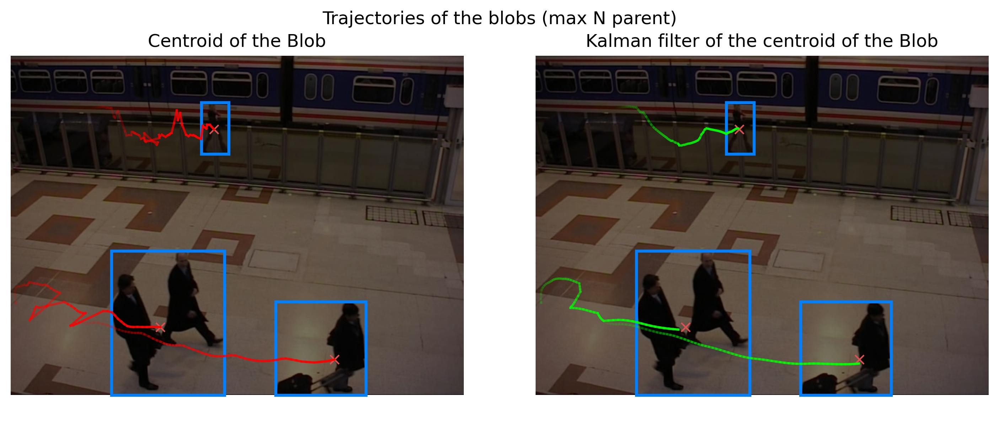
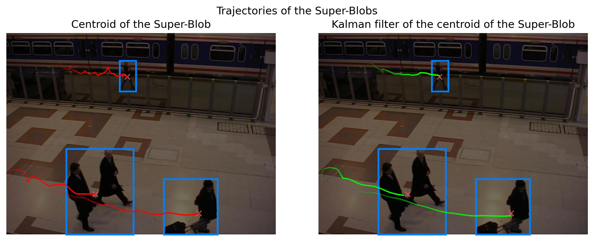

# CV Blob Tracking Using Graphs

This project focuses on tracking moving objects in video sequences using computer vision techniques. The overall goal is to identify distinct moving objects (blobs) across consecutive frames, manage their trajectories when they merge or separate, and apply Kalman filtering to estimate and smooth their paths over time.

## Goal and Results

The tracking system is tested on road traffic (cars) and crowded pedestrian (subway) sequences. The pipeline effectively handles background subtraction, object detection, connected-component splitting, frame-to-frame matching, and graph-based trajectory linking.

Here are some examples of the final tracked paths from the subway sequence:





## Methodology

The project implements a complete tracking pipeline from scratch. The main steps involve:
1. Motion detection via background subtraction.
2. Splitting connected components to separate merged blobs.
3. Matching objects between consecutive frames.
4. Constructing a temporal graph to link trajectories globally.
5. Applying Kalman filters to estimate object states effectively.

A comprehensive explanation of what was done, the theory behind the methodology, and detailed analysis are available in the technical report located in the `REPORT/` directory.

## Directory Structure

A detailed breakdown of the directory structure and the modular components of the `tracking_library` can be found in `docs.md`.

## Running the Project

To run this project, make sure you have installed the required dependencies listed in `requirements.txt`:

```bash
pip install -r requirements.txt
```

To minimally run the pipeline, open the Jupyter Notebooks (`cars.ipynb` and `subway.ipynb`) and execute the cells. 

The notebooks are designed to be efficient: they rely on preloaded intermediate files stored in their respective result directories (e.g., `cars_results/` and `subway_results/`). If a required intermediate file does not already exist, the notebook will compute it on the fly and save the new result. Finally, the notebooks will display the visual results. Every implementation detail is deeply explained in the report.
